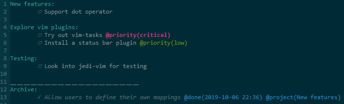

# Vim-Tasks
A small lightweight vim plugin to effectively handle your todo lists. Create todo items, add priorities and other attributes, mark them as complete or cancelled, and archive them. Adjust the look to your own liking.

The todo file is just a plain text document, so you can use it everywhere and use any tool to edit it.



## How to
### Create a todo file
Any file with one of the following extensions will be interpreted as a `tasks` file by vim:
+ `*.TODO`
+ `*.todo`
+ `*.todolist`
+ `*.taskpaper`
+ `*.tasks`

A file called `TODO` is also valid.

### Create a project
Currently all tasks need to be associated with a project. You can create a project by having a single line end in `:`. It will be highlighted¹. An example would be `My Things:`.

### Add tasks
Once you have a project, you can start adding tasks to it by using the `<localleader>n` or `<localleader>N` mappings, the former adds a task below the cursor, the latter above it. A task consists of an indented line according to the project's depth i.e. according to how nested it is followed by a marker `☐`, `✓`, or `✘`. The local leader is a key that should be used together with buffer local mappings, essentially filetype specific mappings. You can have the local leader be the space bar by adding the following line to your `vimrc`:

```
let maplocalleader="\<space>"
```

### Add tags or attributes
You can add any custom tag to a task by starting them with an `@`, such as `@important` or setting a value like `@due(tuesday)`. Priority attributes (`low`, `medium`, `high`, and `critical`) are supported in a special way by provided mappings, and a special syntax highlighting, see [Setting task priority](#setting-task-priority).

### Setting task priority
You can mark a task as `low`, `medium`, `high`, or `critical` priority. You can toggle the priority by using the same mapping that was used to set the initial priority, or you can immediately change the priority by using the mapping for a different priority.

The priority levels are highlighted in a conspicuous manner¹.

+ `<localleader> ml` marks a task as low priority
+ `<localleader> mm` marks a task as medium priority
+ `<localleader> mh` marks a task as high priority
+ `<localleader> mc` marks a task as critical priority

### Sorting tasks by priority
You can use the following mapping `<localleader>S` to sort all tasks in the document by priority per project.

### Transforming tasks
To quickly turn a line into a task or vice versa you can use the following mapping: `<localleader>t` or `<localleader>T`. The latter also removes any attributes that are present.

### Starting tasks
Once you've created a task, you can optionally put it `in-progress` by executing `<localleader>b`. This can help remind you which tasks you were working on and when you started them. It accomplishes the latter by automatically adding a `started` attribute with the current time according to the specified date format. For technical reasons it also adds a unix timestamp. This is required to be able to calculate the amount of time that has passed when marking a task as done or cancelled (see `worked` attribute). Ideally this woulnd't be necessary, but vim doesn't provide an api to parse a string back to a `{time}`.

### Completing tasks
Once you've completed the task, you can mark it as `done` or `cancelled` by the following 2 mappings respectively: `<localleader>d` and `<localleader>x`. This will replace the checkbox by a checkmark `✓` in the former case, or by a cancellation mark `✘`.

Once you complete a task, 2 attributes are added by default. `project` with as value a list of all the projects the task belong to, and `done` with as value the current timestamp. This timestamp can be customized by configuring the following in your `vimrc`:

```
let g:TasksDateFormat = '%Y-%m-%d %H:%M'
```

### Nested lists
As hinted at before, you can easily nest projects. A task is only associated with all its ancestors projects, not its siblings.

### Defaults and customization
Below are the settings that you can currently customize together with their defaults:
+ `let g:TasksMarkerBase = '☐'`
+ `let g:TasksMarkerInProgress = '»'`
+ `let g:TasksMarkerDone = '✔'`
+ `let g:TasksMarkerCancelled = '✘'`
+ `let g:TasksDateFormat = '%Y-%m-%d %H:%M'`
+ `let g:TasksAttributeMarker = '@'`
+ `let g:TasksArchiveSeparator = '＿＿＿＿＿＿＿＿＿＿＿＿＿＿＿＿＿＿＿'`

Below are all the exposed functions with their default bindings:

+ `(TasksNewTaskUp)`: 
  + `<localleader>n`
  + Create a new task below current line.

+ `(TasksNewTaskDown)`: 
  + `<localleader>N`
  + Create a new task above current line.

+ `(TaskBeginTask)`: 
  + `<localleader>b`
  + Toggle current task between any status and the `in-progress` status.
    + This adds the `started` attribute when the task is `in-progress`
    + This adds the `worked` attribute when the task is no longer in progress.

+ `(TasksCompleteTask)`: 
  + `<localleader>d`
  + Toggle current task between any status and the `complete` status.

+ `(TasksCancelTask)`:
  + `<localleader>x`
  + Toggle current task between any status and the `cancelled` status.

+ `(TasksArchiveTasks)`:
  + `<localleader>a`
  + Archive completed (`done`, or `cancelled`) tasks.

+ `(TasksMarkPriorityLow)`:
  + `<localleader>ml`
  + Mark task as low priority.

+ `(TasksMarkPriorityMedium)`:
  + `<localleader>mm`
  + Mark task as medium priority.

+ `(TasksMarkPriorityHigh)`:
  + `<localleader>mh`
  + Mark task as high priority.

+ `(TasksMarkPriorityCritical)`:
  + `<localleader>mc`
  + Mark a task as critical priority.

+ `(TasksSortTasks)`:
  + `<localleader>S`
  + Sort tasks based on their priority.

+ `(TasksToggleTask)`:
  + `<localleader>t`
  + Transform a task into a regular line and vice versa without deleting any existing attributes.

+ `(TasksToggleAndClearTask)`:
  + `<localleader>T`
  + Transform a task into a regular line and vice versa while also deleting any existing attributes.

To define your own mappings, you have 2 options. Modify your `vimrc` or add a file `tasks.vim` inside the `after` directory (`.vim/after/ftplugin`):

+ `vimrc`:

  ```
  augroup tasks
          autocmd!
          au Filetype tasks silent! nmap <buffer> <localleader>tu <Plug>(TasksNewTaskUp)
          au Filetype tasks silent! nmap <buffer> <localleader>td <Plug>(TasksNewTaskDown)
  augroup END
  ```

+ `.vim/after/ftplugin/tasks.vim` (or `vimfiles/after/ftplugin/tasks.vim` on windows)

  ```
  silent! nmap <buffer> <localleader>tu <Plug>(TasksNewTaskUp)
  silent! nmap <buffer> <localleader>td <Plug>(TasksNewTaskDown)
  ```

Anything marked with ¹ in the previous sections will hopefully be configurable in the future.

## Installation
### Vundle
Place this in your `.vimrc`:

    Plugin 'crispydrone/vim-tasks'

... then run the following in Vim:

    :source %
    :PluginInstall

For Vundle version < 0.10.2, replace Plugin with Bundle above.

### NeoBundle
Place this in your `.vimrc`:

    NeoBundle 'crispydrone/vim-tasks'

... then run the following in Vim:

    :source %
    :NeoBundleInstall

### VimPlug
Place this in your `.vimrc`:

    Plug 'crispydrone/vim-tasks'

... then run the following in Vim:

    :source %
    :PlugInstall

### Pathogen
Run the following in a terminal:

    cd ~/.vim/bundle
    git clone https://github.com/crispydrone/vim-tasks

## Roadmap
### v1.0

## Changelog
### 0.12.2 
+ Fixed issue where a task that's on the last line of a file that doesn't end in a new line wouldn't get archived
